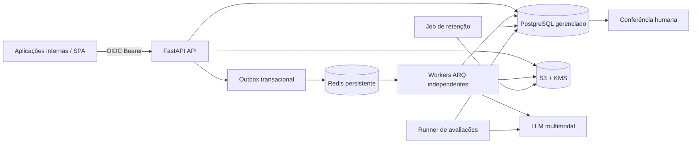

# Arquitetura — DOC Intelligence v2

## Visão

A API e os workers são unidades de deploy independentes. O PostgreSQL é a fonte de verdade do workflow; S3 guarda apenas bytes; Redis guarda jobs duráveis; o outbox fecha a janela entre commit e publicação.

## Fatos do ambiente

### A — Latência, cobrança e falhas do LLM

O request de upload nunca chama o LLM. Um evento é gravado no outbox na mesma transação do documento e publicado no Redis. ARQ aplica timeout e até três tentativas com backoff. Cada chamada gera `extraction_runs` com modelo, prompt, Strategy e latência. O worker usa update condicional `PENDING → PROCESSING`, tornando entregas repetidas inofensivas.

### B — Uploads não confiáveis

A API calcula hash durante streaming, limita bytes, identifica tipo por magic bytes, valida imagem/PDF, número de páginas, criptografia do PDF e dimensão. O nome original é sanitizado e nunca vira chave livre do storage. O worker corrige EXIF e reduz imagens antes do provedor.

### C — Reenvios

`file_hash` possui índice único. Reenvio byte a byte retorna o documento existente e não cria job/cobrança. A constraint resolve uploads simultâneos. Após descarte, o hash é apagado, permitindo novo tratamento se houver nova finalidade/base legal.

### D — PII e LGPD

Objetos usam SSE; produção exige KMS. A API usa TLS no deploy, OIDC e RBAC. Conteúdo é retornado com `private, no-store`. Logs e auditoria não guardam payload, nomes ou valores alterados. Retenção, legal hold e descarte são automatizados e auditados. A tabela de auditoria é append-only no PostgreSQL.

### E — 150/dia e pico acima de 800

Redis absorve o pico e os workers escalam horizontalmente. O default local é oito jobs concorrentes. Com P95 de 40 s, oito slots oferecem capacidade teórica de 12 docs/min, acima dos aproximadamente 6,7 docs/min do pico descrito, antes da margem para retry. Autoscaling deve observar idade da fila, não apenas CPU.

### F — Modelos e prompts mudam

Strategy Pattern e versões persistidas isolam fornecedores. Prompts publicados são imutáveis. O runner compara versões no mesmo dataset golden e mede acurácia por campo, falso aceite e recall da revisão antes do rollout.

### G — Conferência concorrente

Claim e submit são updates condicionais atômicos com operador derivado do `sub` OIDC e lease expirável. Dois operadores não recebem o mesmo item válido. Saves tardios ou de outro usuário retornam HTTP 409.

## Confiabilidade

1. Upload válido é gravado no S3 com criptografia.
2. Documento, auditoria e outbox são confirmados no PostgreSQL.
3. A API tenta publicar o evento.
4. Se Redis estiver indisponível, o evento continua não publicado.
5. O dispatcher periódico do worker republica o outbox com job id determinístico.
6. O worker faz claim atômico; duplicatas de entrega não repetem trabalho já concluído.

Há uma possível sobra de objeto se o processo morrer entre upload S3 e commit. Uma rotina de reconciliação/lifecycle do bucket deve remover objetos órfãos; ela não afeta registros confirmados.

## Processos

- `uvicorn app.main:app`: API, sem execução de LLM.
- `arq app.worker.WorkerSettings`: extração, outbox e retenção.
- `alembic upgrade head`: migração controlada.
- `python -m evals.runner`: avaliação offline/canário.

## Observabilidade necessária

- idade e profundidade da fila;
- outbox não publicado e número de tentativas;
- P50/P95/P99 e timeout do provedor;
- custo por documento e por versão;
- taxa de deduplicação, falha, revisão e falso aceite;
- objetos sem metadado e documentos sem objeto;
- descartes, legal holds e falhas de descarte;
- conexões/pool e locks do PostgreSQL.

## Segurança de deploy

- PostgreSQL e Redis em rede privada, TLS e credenciais rotacionadas;
- bucket privado, bloqueio de acesso público, KMS, versionamento/lifecycle e logs de acesso;
- OIDC corporativo com MFA e grupos mapeados para roles;
- segredos em secret manager, nunca em imagem ou Git;
- WAF/API gateway restrito às redes internas;
- backups criptografados com restauração testada;
- egress do worker limitado ao storage, Redis, PostgreSQL e provedor LLM.

